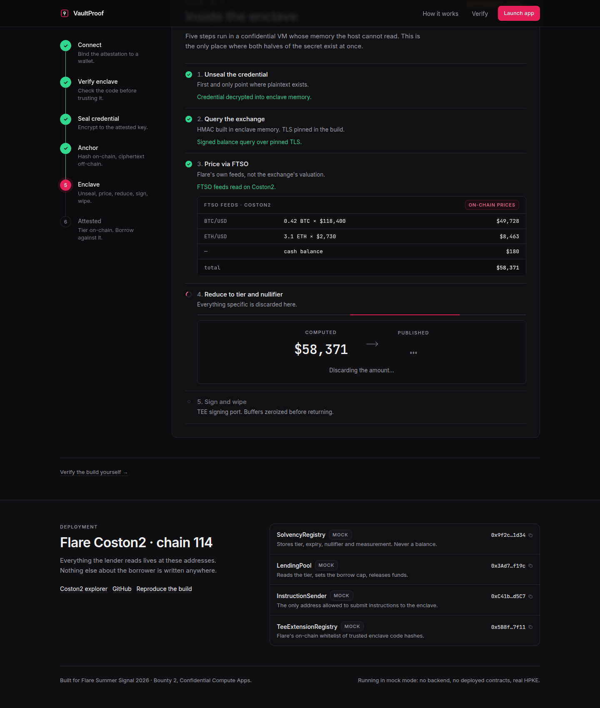

# VaultProof — web

The dapp. Verify a hardware enclave, seal a read-only exchange key to it with real
in-browser HPKE, and borrow against the solvency tier that comes back — with no backend
and no deployed contracts.



## 30-second quickstart

```bash
cd web
npm install
npm run dev            # http://localhost:3000
```

That is the whole setup. Mock mode is the default, so there is no env file to create, no
wallet to install and no testnet funds to acquire. On the connect stage, pick **Demo
wallet** and the full six-stage pipeline runs end to end.

```bash
npm run typecheck      # tsc --noEmit, strict
npm test               # 31 unit tests: the sealing gate, HPKE, attestation verification
npm run audit:secrets  # static check that no plaintext credential can escape
npm run build          # production build
```

## The mode flag

One environment variable selects which world the app talks to:

```bash
NEXT_PUBLIC_VAULTPROOF_MODE=mock   # default — mocked enclave, mocked chain
NEXT_PUBLIC_VAULTPROOF_MODE=live   # real FCE extension, real Coston2
```

Anything other than `live` is treated as `mock`, which is why a zero-config deploy works.
The current mode is shown as a pill in the top right of `/app` and named in the site
footer, so a screen recording can never be ambiguous about what it is showing.

Two optional variables:

| Variable | Effect if unset |
| --- | --- |
| `NEXT_PUBLIC_WALLETCONNECT_PROJECT_ID` | WalletConnect is not offered; injected wallets and the demo wallet still work. |
| `NEXT_PUBLIC_ENCLAVE_URL` | Only read by the live enclave adapter. |

## What's mocked and what's real

The thing that is easiest to fake is the thing this project is about, so it is the one
part that is not faked. The sealing is genuine RFC 9180 HPKE, and the attestation checks
run the real verifier — including the key-binding check that defeats a substituted relay
key.

| Piece | Mock mode | Live mode |
| --- | --- | --- |
| HPKE seal (X25519 / HKDF-SHA256 / ChaCha20-Poly1305) | **Real.** Runs in your browser via `hpke-js`. | Same code. |
| Enclave X25519 keypair | **Real.** Generated at module load; the mock enclave actually unseals what you sealed, so a tampered blob fails. | Generated in the enclave at boot. |
| Attestation verification logic | **Real.** `lib/attestation/verify.ts`, unchanged between modes. | Same code, plus signature-chain validation against the Confidential Space roots. |
| Platform signature / hardware root | Simulated. The quote says so: `mode: 1`, rendered as an amber **SIMULATED** badge. | `mode: 0`, AMD SEV-SNP. |
| Attestation quote transport | In-process, with jittered 600–2500 ms latency. | `GET /quote` against the FCE extension. |
| TeeExtensionRegistry whitelist | Two fixture hashes. | On-chain read from Coston2. |
| Chain writes (anchor, attest, borrow) | Deterministic fake tx hashes, persisted in `localStorage` so a refresh mid-demo does not lose the run. | Real Coston2 transactions with explorer links. |
| Exchange call and FTSO pricing | Fixture holdings from the spec's worked example: 0.42 BTC, 3.1 ETH, $180 → $58,371 → T3. | Kraken over pinned TLS; FTSO feeds read on Coston2. |
| Contract addresses | Placeholders, tagged `mock` everywhere they appear. | `lib/config/addresses.ts`. |

## Trying to break it

Mock mode ships the threat model's attacks as buttons. On stage 2, **Try breaking it**
runs them against the same verifier the honest path uses:

- **Relay swaps the key** — an attacker public key served alongside the enclave's genuine
  signed quote. Check (b) fails, the flow hard-stops, and stage 3 never mounts.
- **Unwhitelisted build** — an image the chain has never trusted. Check (c) fails.

There is no override button in either case, which is the point.

## Architecture

```
app/                    Routes: / (landing), /app (pipeline), /how-it-works, /verify
components/
  app/                  The six pipeline stages, the stepper, the lending panel
  landing/ docs/ site/  Page-specific sections
  ui/                   Button, Badge, Mono (copy-on-click), Status, Section, Toast
lib/
  adapters/             THE SEAM — see below
    types.ts            EnclaveClient and ChainClient interfaces
    mock/               Full implementations: latency, fixtures, persisted state, attacks
    live/               Stubs that throw "not wired yet"
  abis/                 SolvencyRegistry, LendingPool, InstructionSender, TeeExtensionRegistry
  attestation/verify.ts The three client-side checks
  config/               addresses, chain (Coston2), tiers, mode, links
  crypto/hpke.ts        Real sealing; context binding lives here
  store/pipeline.ts     The state machine, and the gate
scripts/audit-secrets.sh
```

### The adapter seam

Everything the UI knows about "the enclave" and "the chain" is two interfaces in
`lib/adapters/types.ts`. Going live means filling in `lib/adapters/live/` and setting the
mode flag — no file under `app/` or `components/` references a mock, an address literal or
a transport.

### Credential handling

The plaintext exchange key lives in two uncontrolled inputs and one local variable inside
one submit handler. It is never placed in React state, never in the zustand store, never
in `localStorage`, and never sent anywhere — what leaves the component is ciphertext.
`npm run audit:secrets` enforces all of that statically, including that the plaintext
buffer is zeroed and that the sealing gate is still in the store.

## Deploying

Mock mode deploys with no secrets at all.

```
Vercel → New Project → import this repo → set Root Directory to `web` → Deploy
```

Nothing else is required: the framework is detected, and `NEXT_PUBLIC_VAULTPROOF_MODE`
defaults to `mock` when absent.

## Accessibility and motion

One polished light theme, no dark mode. Every interactive element has a visible
keyboard-focus ring, every hash is a real `<button>` that copies on click and announces
itself, and the pipeline's status changes are exposed to assistive tech. All animation
respects `prefers-reduced-motion`, including the reduce-step dissolve.
